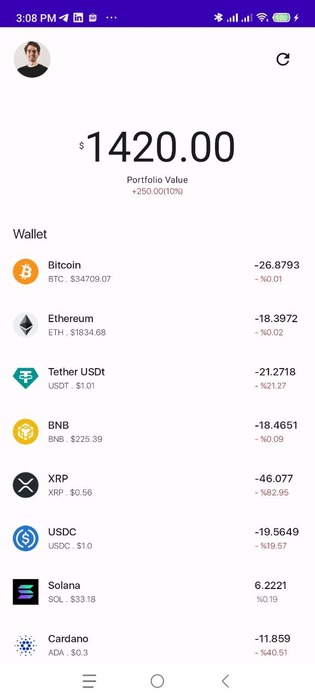
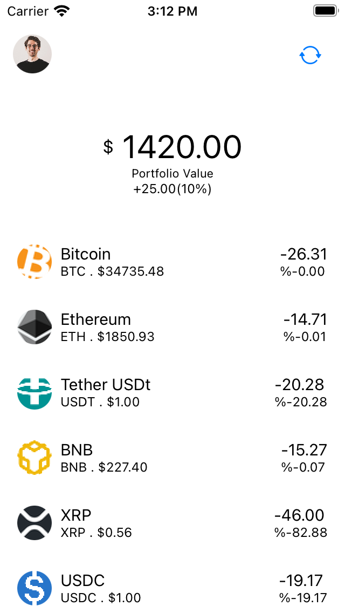

# kmp-crypto
Crypto App client with shared data and domain layer with kotlin multiplatform

## Architecture

## Stack
Data: 
1. Remote
    - Ktor : HTTP Client (API https://coinmarketcap.com/api/documentation/v1/)
2. Local
   - SqlDelight : Sqlite (Use for caching data / offline suport)
3. Dependency Injection
   - Koin
   
  
Domain:
 - Wrap to UseCase

Presentation: Home
- Android : Jetpack Compose 
- iOS : Swift UI

## Android

## iOS

### Compose Multiplatform 

Exploring compose multiplatform build shared presentation / view both android and iOS 

